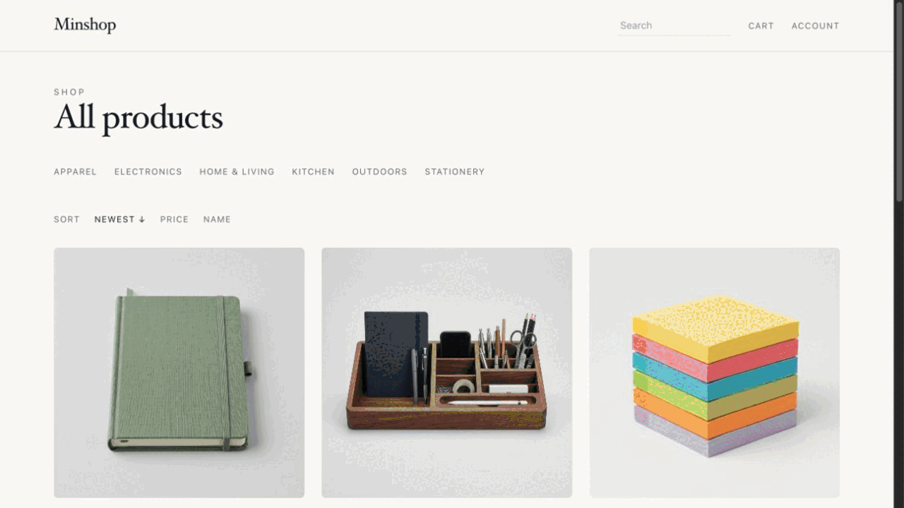
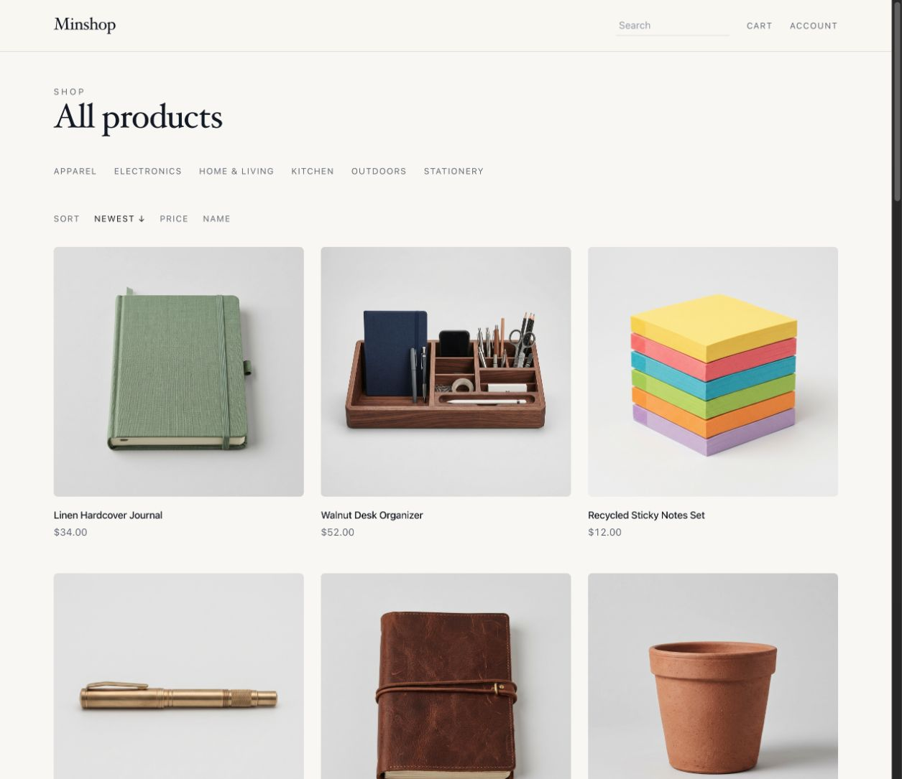
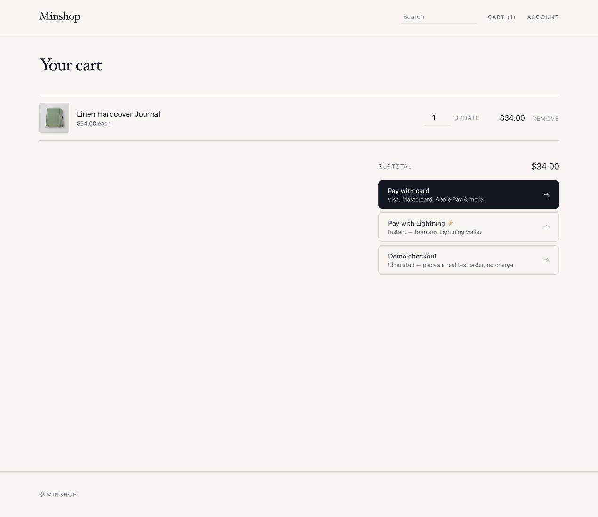
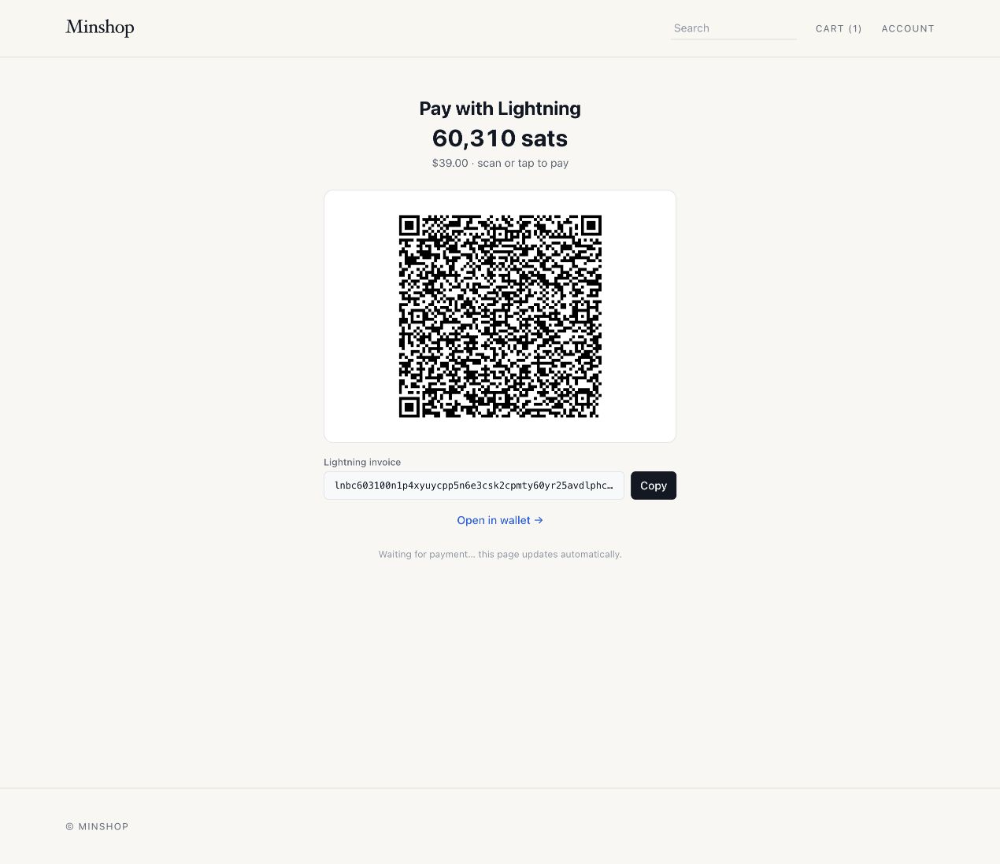
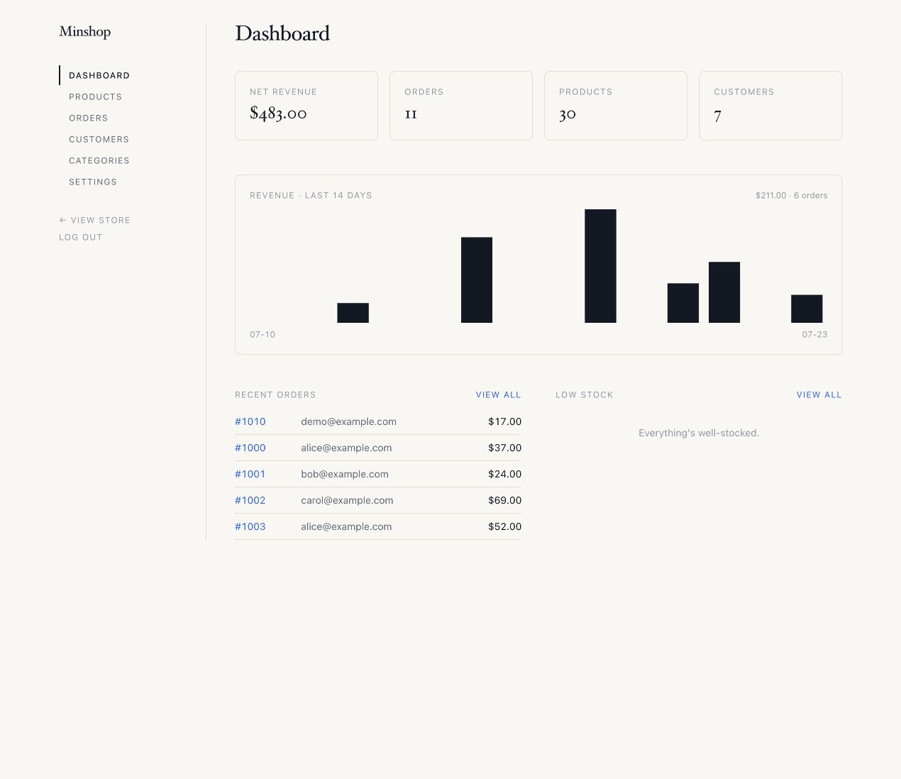

# minshop

[](https://github.com/ddyy/minshop/actions/workflows/verify.yml)
[](https://www.npmjs.com/package/create-minshop)
[](https://www.npmjs.com/package/create-minshop)
[](LICENSE)

An open-source store an agent can pay for itself. Agents read the catalog and pay a Lightning invoice with no human in the loop — over plain JSON or over MCP; people check out the normal way with Stripe. Merchants can run the store over MCP too.

It's a small, server-rendered store for Cloudflare Workers (D1 + R2) with a full admin, multiple payment rails, and an optional MCP server, within the free tier to start. No brand is baked in: store name and time zone are set during onboarding, so it clones cleanly as a template.

**[Live demo](https://demo.minshop.dev/)** (agent API at /api/products, /api/checkout). Uses test payments; do not enter real personal information.



<table>
  <tr>
    <td><a href="docs/media/storefront-desktop.png"></a></td>
    <td><a href="docs/media/cart-payment-rails.png"></a></td>
  </tr>
  <tr>
    <td align="center">Storefront</td>
    <td align="center">Cart with three payment rails</td>
  </tr>
  <tr>
    <td><a href="docs/media/lightning-invoice.png"></a></td>
    <td><a href="docs/media/admin-dashboard.png"></a></td>
  </tr>
  <tr>
    <td align="center">Lightning checkout</td>
    <td align="center">Admin</td>
  </tr>
</table>

It's intentionally lightweight and cheap to start. The default deployment uses Cloudflare Workers, D1, and R2 and can fit within their free-plan allowances; payment providers and optional services have their own pricing.

## Scaffold a store

> **Requires Node ≥ 22.12 and Git.**

```sh
npm create minshop@latest my-store
cd my-store
npm run provision:local -- --seed
npm run dev
```

The initializer creates a clean repository and installs both the storefront and
MCP dependencies. Use `--no-install` to only scaffold the files, or
`--ref <branch-or-tag>` to start from a specific revision.

## Features

- **Storefront** — server-rendered product list + product detail, near-zero client JS
- **Cart** — HttpOnly cookie-based, with a progressively enhanced drawer plus no-JS form fallbacks
- **Search** — FTS5 full-text (bm25, prefix match, typo-correct), no JS — or optional **semantic search** via Workers AI + Vectorize (see [Search](#search))
- **Categories** — nested (arbitrary-depth tree), many-to-many with products; storefront category pages with breadcrumbs + sub-category drill-down (recursive descendant queries)
- **Admin** — products, categories, pages, media, orders, customers, fulfillment, CSV export, and runtime store settings
- **Payments** — Stripe Checkout, self-hosted Bitcoin Lightning (phoenixd or LNbits), hosted OpenNode, or a built-in demo rail; configure enabled methods and the default in Admin (see [Payments](#payments))
- **Shipping** — merchant-managed zones, flat **or weight-banded** rates, and free-over-threshold rules, edited in Admin with no redeploy; supported checkout flows capture the address, chosen service, and shipping cost on the order
- **Discount codes** — promo-code field enabled from Admin; codes are created/managed in the Stripe Dashboard, and the applied discount is captured onto the order
- **Tax** — sales tax / VAT via Stripe Tax (off by default — **activate Stripe Tax in the Dashboard first**); computed from the customer address and captured onto the order
- **Order email** — confirmation email behind an `EmailProvider` seam with two adapters: **Resend** (HTTPS API, works on the Workers free plan) or **Cloudflare Email** (binding, paid plan); configured in Admin and a safe no-op until a provider is ready
- **Pages** — merchant-authored Markdown pages at `/pages/<slug>`, with a split-view editor, live preview, and layout presets (see [Pages](#pages))
- **Media library** — one place that owns every uploaded file; products, pages, and the logo record how each is used (see [Media library](#media-library))
- **Images** — uploaded to R2, served through the app (no public bucket required)
- **Swappable seams** — payments and storage sit behind interfaces (see [Architecture](#architecture))

## Engineering highlights

A few decisions in here are worth reading even if you never deploy a store:

- **Payments sit behind a port.** Checkout and webhook routes depend on a `PaymentProvider` interface rather than any one vendor. Stripe, Lightning (phoenixd or LNbits), OpenNode, and the demo rail are adapters, so adding a rail is one adapter plus its webhook route. Storage works the same way (`StorageProvider`, with R2 as the adapter).
- **HTML first, JS as enhancement.** Pages render on the server and ship near-zero client JavaScript. Cart, search, and checkout all work with JS disabled; the cart drawer and live search are progressive enhancements layered on plain forms.
- **Search without a search service.** Full-text search runs on SQLite FTS5 inside D1, with bm25 ranking, prefix matching, and typo correction. Semantic search (Workers AI + Vectorize) is an optional flag, not a dependency.
- **Cache invalidation follows what shoppers can see.** Cached pages carry `shell`, `catalog`, and per-product tags. Admin writes purge only the affected tags, and stock changes purge a product only when it crosses In stock / Low stock / Sold out, not on every checkout reservation. The page shell stays shared even for cookied shoppers because the one personal detail, the cart count, loads from a small private fragment.
- **Provider keys are write-only.** Stripe, Lightning, and email credentials are entered in Admin, encrypted under a KEK before they reach D1, and never displayed again. The Worker itself needs exactly two secrets.
- **Refactors are gated by equivalence tests.** The Vitest suite (70 test files) renders `.astro` components through AstroContainer and includes contract tests plus rendering baselines, so template extractions have to prove they didn't change the output a customer sees.
- **The same store serves people and agents.** Catalog and checkout are exposed as HTML, as JSON (`/api/products`, `/api/checkout`), and over MCP — all three reach the same checkout, so an agent can browse the catalog and settle a Lightning invoice with no human in the loop.

## Stack

| Piece | Choice |
|---|---|
| Framework | [Astro](https://astro.build) (SSR) on Cloudflare Workers via `@astrojs/cloudflare` |
| Styling | Tailwind CSS v4 (`@tailwindcss/vite`) |
| Data | Cloudflare D1 (SQLite) — products, orders |
| Images | Cloudflare R2 — zero egress |
| Payments | Stripe Checkout, Bitcoin Lightning (phoenixd / LNbits), OpenNode, or demo |

## Quick start (local)

> **Requires Node ≥ 22.12** — use Node 22, the tested/supported release line.

```sh
npm install

# One shot: build, migrate + seed the local DB, and generate the two local
# secrets (SECRETS_KEK + AUTH_SECRET) into .dev.vars
npm run provision:local -- --seed

npm run dev                        # http://localhost:4321
```

Storefront is at `/`, admin at `/admin` — first visit lands on the **setup wizard**. There are no provider secrets to fill in by hand: payment/email/Turnstile keys are pasted in **Admin → Settings** and stored encrypted in D1 (see [Settings](#settings)). Granular scripts also exist (`db:migrate`, `db:seed`), `npm run preview` runs the built worker in prod-mode (admin gate active), and `npm run destroy:local` resets the local store.

### Tests

```sh
npm test          # vitest run (unit tests for pure logic)
npm run test:watch
npm run test:d1   # fresh migrations + seed + built Worker against isolated D1
```

Covers the pure functions — `slugify`, the FTS search sanitizer + edit-distance, `parseProductForm`, image validation, cart counting, reservation target aggregation, the order-number scheme, the Access-JWT verifier, pagination clamping, and the whitelisted `orderByClause` sort builders (the SQL-injection boundary for sortable tables). `npm run test:d1` adds clean-room D1 gates for reservation concurrency/release/settlement/legacy compatibility, then boots the production Worker against an isolated database and runs a demo checkout through paid-order settlement and confirmation. `npm run verify` runs both suites, full Astro diagnostics, the production build, and the MCP typecheck/deployment dry run.

### Testing payments locally

Paste your `sk_test_…` key in **Admin → Settings → Payments → Card (Stripe)**, then forward Stripe events to your dev server with the [Stripe CLI](https://docs.stripe.com/stripe-cli):

```sh
stripe listen --forward-to localhost:4321/api/webhook
# paste the printed whsec_… into Settings → Payments → Card (Stripe) → webhook signing secret
stripe trigger checkout.session.completed
```

The order shows up in `/admin` (and in D1: `npx wrangler d1 execute minshop-db --local --command "SELECT * FROM orders"`).

## Deploy

### One-click (Deploy to Cloudflare)

[](https://deploy.workers.cloudflare.com/?url=https://github.com/ddyy/minshop)

Forks the repo, provisions D1 plus separate R2 buckets for public images (`minshop-images`) and private deliverables (`minshop-files`), applies migrations, and deploys the free-plan default. The files bucket must stay private: never enable r2.dev or attach a custom domain. Then finish onboarding at `/admin/setup` (below). Cloudflare Images, semantic search, and Cloudflare Email are opt-in; their bindings are commented in `wrangler.jsonc`.

**Fields the deploy form shows:**

- **`SECRETS_KEK`, `AUTH_SECRET`** (masked, required) — the only two values you must supply. Paste a fresh random value into *each* (they must differ): run `openssl rand -base64 32` twice. The button can't generate them, and masked-field hints are hidden, so a leading label field named **`USE_A_LONG_RANDOM_STRING_FOR_SECRETS_KEK_AND_AUTH_SECRET`** carries the instruction above them; its value is unused.
- **Location hint** — Cloudflare's own field for where to place the D1 database; pick the region nearest your shoppers.
- **No store name / time zone / search fields** — those are runtime settings you configure in the setup wizard and **Admin → Settings** (stored in D1), not at deploy time. Defaults until then: `My Shop` / `UTC` / keyword (FTS) search.

### CLI (one shot)

**One shot** — provisions a fresh, fully-independent instance (its own D1, R2, Vectorize index, Worker) and sets both Worker secrets:

```sh
npm create minshop@latest my-store
cd my-store
npx wrangler login
npm run provision:cf my-store      # scripts/provision-cf.sh <slug>
```

Or **manually**:

```sh
npx wrangler login

# Provision real resources. The committed wrangler.jsonc declares D1/R2 by NAME
# with no ids (so a one-click / Workers Builds deploy auto-provisions them); for a
# manual deploy, add the printed database_id to the "DB" entry — or let
# `wrangler deploy` create it.
npx wrangler d1 create minshop-db
npx wrangler r2 bucket create minshop-images
npx wrangler r2 bucket create minshop-files   # FILES binding; keep private
npm run db:migrate:remote          # applies migrations/ to the production DB

# The only two REQUIRED Worker secrets. The optional cache-purge secret is
# covered under Caching below. Everything else (Stripe, OpenNode, Lightning,
# Resend, Turnstile keys + their config) is entered in Admin → Settings and
# stored encrypted in D1 under SECRETS_KEK.
openssl rand -base64 32 | npx wrangler secret put AUTH_SECRET   # signs sessions
openssl rand -base64 32 | npx wrangler secret put SECRETS_KEK   # encrypts the key vault

npm run deploy                     # migrate, build, deploy, then purge shared cache if enabled
```

Then open the site — it funnels to the **setup wizard**: set the admin password (required to finish; until then `/admin/setup` is open, so do it right away or front `/admin` with Access), then paste your payment keys in **Settings → Payments**. Finally point a **production Stripe webhook** at `https://<your-host>/api/webhook/stripe` (events: `checkout.session.completed`, `checkout.session.async_payment_succeeded`, `checkout.session.async_payment_failed`, `checkout.session.expired`, and `charge.refunded`; async success fulfils delayed methods, failure/expiry releases held inventory, and `charge.refunded` keeps refunds made in the Stripe Dashboard — including partial ones — in sync with your order totals) and paste its `whsec_…` signing secret in the same card. Tear an instance down with `npm run destroy:cf <slug>`; reset its data in place with `npm run reset:remote`.

## Admin auth

Both `/admin` **and** `/api/admin/*` are gated by [`src/middleware.ts`](src/middleware.ts). You authenticate one of two ways:

- **Setup-wizard password (built-in).** On a fresh store the setup wizard at **`/admin/setup`** is reachable so you can create an admin password; it's stored as a PBKDF2 hash in D1 (there is **no `ADMIN_PASSWORD` env var**). The moment you save it the gate activates: `/admin` + `/api/admin` require sign-in at **`/admin/login`** (a form issuing an HMAC-signed, HttpOnly session cookie; `/api/admin` returns 401 instead of redirecting), and saving logs you in immediately. **First-run is open** — until a password exists, `/admin/setup` is publicly reachable, so set it promptly on a public deploy (or front `/admin` with Access, below).
  - **Optional Turnstile** on the login form: enable it in **Admin → Settings → Bot protection** (toggle + sitekey, with the secret stored in the encrypted vault) to add Cloudflare's bot challenge before the password is checked. The same toggle also gates the customer account sign-in. Cloudflare's documented always-pass test keys work for local trials.
- **Cloudflare Access (recommended for production).** Edge SSO/MFA, no app passwords, and it protects first-run setup too. In the Zero Trust dashboard add a **self-hosted application** covering **both** paths `your-host/admin` *and* `your-host/api/admin` (the API is a separate path — gating only `/admin` leaves the mutation endpoints open), add an identity provider (One-time PIN is enough), and an Allow policy for your email. Set both `CF_ACCESS_TEAM_DOMAIN` and `CF_ACCESS_AUD` in `wrangler.jsonc` vars; they are **required for Access mode** so the middleware can verify every JWT signature (zero-dependency, Web Crypto — see [`src/features/auth/access.ts`](src/features/auth/access.ts)). With either variable present, requests fail closed unless both are set and a valid assertion is supplied—including direct `*.workers.dev` requests with no header. (Use Access *or* the wizard password; if a password is set, password login takes precedence.)

**Forgot the admin password?** The hash lives in your D1 database, so the store owner can always reset it — clearing it drops the store back into the open setup wizard:

```bash
npm run admin:reset:remote   # deployed store  (or: npm run admin:reset for local)
```

Then reload `/admin/setup` and set a new one. (Same effect as running `DELETE FROM settings WHERE key='admin_password_hash';` in the Cloudflare dashboard → D1 console.) It requires Cloudflare account access, so it isn't a public reset — and if you run Cloudflare Access you're never locked out in the first place.

Local dev (`astro dev`) bypasses the gate so you're never locked out. Don't make `/admin` a "secret" path — that's security-through-obscurity; the gate is what protects it.

The Worker also applies native edge rate limits to anonymous login POSTs (10/minute per store, route, and connecting client), checkout/invoice POSTs (20/minute), and cache-missing public searches (60/minute). Search input is normalized and capped at 200 characters before FTS or Workers AI sees it; instances that enable Workers Caching keep public catalog/search responses for up to 10 minutes. Webhooks and authenticated admin APIs are deliberately excluded; provider signatures and the admin gate protect those paths without disrupting legitimate retries or bulk administration. The limits are declared as `AUTH_RATE_LIMITER`, `CHECKOUT_RATE_LIMITER`, and `SEARCH_RATE_LIMITER` bindings in the provisioning template; existing manually maintained Wrangler configs need the same `ratelimits` block.

## Caching

Workers Caching uses its native entrypoint + path/query key, so tracking parameters
create separate entries; keep internal links canonical and measure fragmentation
before adding a gateway solely for key normalization. The shell remains shared
even when a shopper has cookies. Its only customer-specific header value, the
cart count, loads from a tiny private fragment; the complete cart stays on
private, `no-store` routes and is fetched only when opened.

Caching is deployment-controlled and disabled in the generic config. It is not
an Admin setting because cache lookup occurs before the Worker runs. Enable it
only for an instance with one public hostname: move the instance to a custom
domain, set `CANONICAL_ORIGIN` to its exact HTTPS origin, disable the
`workers.dev` ingress, and enable Workers Caching in the same rendered
`wrangler.jsonc`:

```jsonc
{
  "workers_dev": false,
  "vars": {
    "CANONICAL_ORIGIN": "https://shop.example.com"
  },
  "cache": {
    "enabled": true
  }
}
```

`CANONICAL_ORIGIN` stabilizes absolute URLs in shared HTML, catalog JSON,
sitemap, robots, and `llms.txt`; internal storefront links remain
root-relative.

### Invalidation

Cacheable responses carry `shell`, `catalog`, and public
`product:prod_…` tags. Low-frequency Admin changes purge the affected tags after
their D1 write; a failed tag purge falls back to purging the entrypoint cache.
Checkout reservations and releases purge only when the customer-visible stock
state changes: products cross `In stock` / `Low stock` / `Sold out`, or a variant
crosses available / sold out. Exact stock counts appear only on private cart and
checkout pages. Stock purges target the affected `product:prod_…` tags, are
best-effort, and never fall back to purging the whole cache; the bounded
10-minute shared TTL remains the safety net for rate limits or transient purge
failures.

### Cross-version cache

By default, a deployment starts with a cold, version-keyed cache. An instance
that deploys frequently may add `"cross_version_cache": true` beside
`cache.enabled`, but only after setting the same `CACHE_PURGE_SECRET` in the
Worker and its deploy environment (an uncommitted `.dev.vars` is supported).
Use a dedicated random value so deploy access never requires distributing or
rotating `AUTH_SECRET`; the latter remains a compatibility fallback.
`npm run deploy` preflights that secret plus the single canonical hostname,
deploys, then calls a short-lived HMAC-authenticated Worker endpoint to purge
the shared cache. It retries transient purge failures. If all attempts fail,
the new Worker is already live: retry the deploy, then temporarily set
`cross_version_cache` to `false` and deploy again to recover with a cold
version-keyed cache.

Generate one random value, enter it at Wrangler's secure prompt, and put the
same value in the deploy machine's uncommitted `.dev.vars`:

```bash
openssl rand -base64 32
npx wrangler secret put CACHE_PURGE_SECRET
```

```dotenv
# .dev.vars — do not commit
CACHE_PURGE_SECRET=<the same random value>
```

Then enable the shared cache:

```jsonc
"cache": {
  "enabled": true,
  "cross_version_cache": true
}
```

### Smart Placement (optional)

[Smart Placement](https://developers.cloudflare.com/workers/configuration/placement/)
can reduce cache-miss and private-route latency by running the Worker closer to
D1 and other backends when Cloudflare determines that the extra network hop is
worthwhile. Cache hits and directly served static assets remain edge-local.
Enable it per instance and compare Workers request-duration analytics before
making it a default:

```jsonc
"placement": {
  "mode": "smart"
}
```

Cloudflare may take up to 15 minutes and traffic from multiple locations to
analyze the Worker. A `cf-placement` value such as `local-LAX` means execution
stayed near the incoming request; `remote-LHR` means Cloudflare forwarded
execution to another data center. Treat the header as diagnostic only because
it is currently a beta interface.

## Payments

Checkout and the webhook depend on a `PaymentProvider` port (`src/features/payments`). Every rail is configured in **Admin → Settings → Payments** — its keys go in the encrypted vault, its config (default rail, node URLs) in D1 settings; a rail's checkout button appears automatically once its key is set, and the always-on **Demo** checkout works with zero keys. Demo reserves and decreases inventory like a real checkout, but never charges the buyer. The "default rail" selector picks which one is offered first:

| Rail | What it is | Setup (all in Settings → Payments) |
|---|---|---|
| `stripe` *(default)* | Hosted card checkout | paste the secret key + webhook signing secret |
| `lightning` | Bitcoin Lightning via a **self-hosted** node — minshop mints a BOLT11 invoice and renders its own `/pay` page (QR + `lightning:` link), then confirms settlement | run **phoenixd** or **LNbits** (below); enter its URL + key |
| `opennode` | **Hosted** Lightning checkout (custodial processor) — redirect + webhook, like Stripe | paste the OpenNode API key |

Two ports, nested: the outer `PaymentProvider` (stripe / lightning / opennode) and an inner `LightningBackend` (phoenixd / lnbits) shared by the self-rendered flow. Adding another node is one adapter file.

**How settlement is trusted.** Lightning webhooks are treated as an untrusted *nudge* — on receipt minshop **re-polls the node** for the payment (the authority), so a forged webhook can't fake a sale. The `/pay` page also settles on load by polling, so it works even with no public webhook (e.g. local dev). Orders stay "paid-only": unpaid invoices live in a `pending_payments` table, never in `orders`.

**Shipping (in-app rails).** When shipping is enabled, the Lightning, OpenNode, and Demo carts route through minshop's own `/checkout` page — a server-rendered address + shipping-option step priced from the Admin-managed zones (see [Shipping](#shipping-and-order-email)) — so the invoice total includes shipping and the address + email land on the order, same as Stripe. The Demo rail arrives with a sample address prefilled (it ships nowhere; the step exists to exercise the real rate configuration). Programmatic checkout accepts the same address as a `ship_to` object. (Stripe keeps its own hosted address/shipping collection, unchanged.)

**Limitations (Lightning).** **Tax** and promo codes are still Stripe-Checkout features and are skipped on the Lightning path — to charge tax on a non-Stripe rail you'd compute it yourself (e.g. Stripe's Tax *Calculation* API) and add it to the total. No automatic refunds (Lightning can't reverse in place). Invoices are priced in sats from a BTC spot rate fetched at checkout (`payments.lightning.rateUrl`, default Coinbase — no key).

### Running phoenixd (recommended self-hosted backend)

[phoenixd](https://phoenix.acinq.co/server) is ACINQ's self-custodial headless daemon — no full Bitcoin node, no manual channel management (ACINQ is the LSP), mainnet (real sats).

1. Run `phoenixd` on an always-on host (small VPS / Pi). First launch writes a **seed** to `~/.phoenix/` — back it up.
2. Expose its API (`127.0.0.1:9740`) to the Worker over HTTPS — a **Cloudflare Tunnel** (`cloudflared`) is the cleanest, no open ports.
3. In **Settings → Payments → Lightning**, pick the phoenixd node, enter its public URL, and paste the password — use the **`http-password-limited-access`** value (`~/.phoenix/phoenix.conf`): receive-only, can't spend.
4. Point phoenixd's `webhook-url` at `https://<your-host>/api/webhook/lightning`.

**LNbits** instead: pick LNbits in the same card and enter its URL + the wallet's *Invoice/read key*. **OpenNode**: paste the API key in its card and set the default rail to OpenNode.

## Architecture

Organized as **feature folders** (vertical slices) — each owns its data access, types, and components.

```
src/
  config.ts                  build-time defaults and feature toggles
  store.config.ts            per-store build-time overrides
  layouts/Layout.astro
  features/
    auth/       admin, customer sessions, Access, Turnstile
    media/      the shared file library — the only feature that deletes objects
    pages/      Markdown pages: rendering, slugs, layout presets, save/media sync
    products/   catalog data, forms, inventory, image handling
    orders/     order data, reservations, tracking
    payments/   provider port + Stripe, Lightning, OpenNode, demo adapters
    settings/   runtime D1 settings
    storage/    provider port + R2 adapter
  pages/
    index.astro               storefront
    products/index.astro       catalog list (also rendered at /)
    products/[slug].astro
    categories/[slug].astro
    pages/[slug].astro        merchant-authored Markdown pages
    product/[slug].astro      301 → /products/[slug] (retired URL)
    category/[slug].astro     301 → /categories/[slug] (retired URL)
    admin/                    products, categories, pages, media, orders, customers, settings
    images/[...key].ts        serves private R2 objects
    api/                      catalog, checkout, webhooks, admin mutations
```

Two **ports-and-adapters seams** keep vendor code at the edges:

- **`PaymentProvider`** — checkout and webhook routes depend on the interface rather than a single provider. Adding another rail means implementing an adapter and wiring its settings and webhook route.
- **`StorageProvider`** — the app stores and serves images by key; R2 is one adapter.

Deliberately **no runtime plugin system** — Workers bundle at build time, so composition is just imports + a factory.

## Database migrations

Schema lives in `migrations/` as numbered, additive SQL files (D1 tracks which have run, so deploys only apply new ones). To evolve the schema, add a new file — never edit an applied one:

```sh
npx wrangler d1 migrations create minshop-db add_product_sku   # writes migrations/0002_…
# edit it (ALTER TABLE / CREATE TABLE — additive, no destructive DROP)
npm run db:migrate            # local
npm run db:migrate:remote     # production
```

`seed.sql` is dev-only sample data (re-runnable), kept separate from schema.

## Settings

Most settings are **runtime** — changed in **`/admin/settings`**, stored in a D1 `settings` table, applied instantly, no redeploy. Secret keys are stored in the same table **AES-256-GCM-encrypted** under the `SECRETS_KEK` Worker secret (write-only from the UI, never echoed back), which is what makes an instance fully configurable — and clonable — from the dashboard:

- **General** — store name.
- **Features** — cart/checkout, "Buy now", discounts, tax, customer accounts, shipping, and upload optimization.
- **Images** — original delivery or responsive Cloudflare on-demand transformations.
- **Payments** — one card per rail (Stripe / Lightning / OpenNode / Demo): its on/off toggle, config (node URLs, default rail), and keys.
- **Email** — on/off, provider (Resend / Cloudflare), from-address, key, send-test button.
- **Bot protection** — Turnstile toggle + sitekey + secret.
- **Search** — keyword (FTS5) vs semantic (Workers AI + Vectorize) + reindex.

A few **data-coupled** settings stay build-time (change + `npm run deploy`):

| Setting | Where | Effect |
|---|---|---|
| Currency | `currency` in `src/store.config.ts` | One store-wide currency — prices are stored as integer minor-units bound to it, so it can't safely flip at runtime |
| Image width | `images.maxWidth` in `src/store.config.ts` | Maximum width used when image optimization is enabled in Admin |
| Order number | `orderNumber.{offset,step,randomStep}` in `src/store.config.ts` | Friendly customer-facing number derived from the internal id (e.g. `#1000`). `step` spaces them out; `randomStep` adds jitter to obscure the count (keep `step > randomStep`). The URL/security uses the random `public_id`, not this number |
| Favicon | replace `public/favicon.svg` and regenerate `public/favicon.ico` | Browser tab icon with a legacy-client fallback |

Change a value, then `npm run deploy`. Currency uses `Intl.NumberFormat`, so `usd → $`, `eur → €`, `gbp → £`, `jpy → ¥` (decimals handled per-currency).

### Optional upload optimization

The default deployment stores original uploads in R2 and serves them through the Worker. Astro uses its `passthrough` image service, so deploying minshop does **not** automatically provision an `IMAGES` binding.

To optimize new uploads:

1. Uncomment `"images": { "binding": "IMAGES" }` in `wrangler.jsonc` (or add the same binding to a provisioned instance config).
2. Run `npm run deploy`.
3. Enable **Optimize images on upload** in Admin → Settings. Optionally override `images.maxWidth` in `src/store.config.ts`.

[Cloudflare Images transformations](https://developers.cloudflare.com/images/pricing/) are available on Free and Paid plans. The Free plan currently includes 5,000 unique transformations per month; when the binding is missing or a transformation fails, minshop stores the original upload instead. Existing R2 objects are not retroactively transformed by this upload-time option.

### Serving images off the Worker (R2 custom domain)

By default all uploads — product images, page images, and the logo — are served through the Worker's `/images/<key>` route. That's zero-config, but every image request still invokes the Worker (the `caches.default` edge cache saves the R2 fetch, not the invocation). For higher traffic, serve images straight from R2 so they bypass the Worker entirely — Cloudflare CDN-caches them and your Worker request count drops to page + API traffic only.

1. Connect a [public custom domain](https://developers.cloudflare.com/r2/buckets/public-buckets/) to the bucket: Cloudflare dashboard → **R2 → your bucket → Settings → Public access → Connect a custom domain** (e.g. `images.example.com`, on a zone in your account). Set **Minimum TLS** to 1.2. This makes the bucket's objects **publicly readable** through that domain — fine for product images, but don't point it at a bucket holding anything private.
2. Add the var to `wrangler.jsonc` (absolute, no trailing slash) and redeploy:
   ```jsonc
   "vars": { "IMAGE_BASE_URL": "https://images.example.com" }
   ```

Every image URL — storefront, product galleries, `/api/products`, order emails, Stripe line items, page bodies, and the header logo — then points at that domain. Page bodies store the root-relative `/images/<key>` form and the origin is applied at render time, so changing `IMAGE_BASE_URL` never requires rewriting content. Unset, images keep serving through the Worker route (nothing else changes).

**Caching:** uploads store a 1-year `immutable` `Cache-Control` (keys are unique per file), so the R2 domain serves them with that TTL. Objects uploaded before this change — or via `wrangler r2 object put` without `--cache-control` — keep R2's shorter default TTL until re-uploaded (e.g. `--cache-control 'public, max-age=31536000, immutable'`) or covered by a [Cache Rule](https://developers.cloudflare.com/cache/how-to/cache-rules/).

### Responsive on-demand images

With an R2 custom domain configured, the storefront can serve a responsive
128/384/768/1024 width ladder through Cloudflare Image Transformations. The browser
gets AVIF, WebP, or a standard format according to its `Accept` header; email
receipts use one fixed 96px JPEG thumbnail URL. Originals remain in R2 and are the
fallback if a transformation fails.

1. In the Cloudflare dashboard, open **Images → Transformations**, select the
   storefront zone, and enable transformations.
2. Under **Sources**, allow the R2 image hostname configured by `IMAGE_BASE_URL`
   (for example, `images.example.com`). Keep sources restricted rather than allowing
   arbitrary origins.
3. In **Admin → Settings → Images**, select **Cloudflare on-demand**.

The URL interface does not require an `IMAGES` Worker binding. That binding is only
needed for the separate **Optimize images on upload** feature. Existing product
images work immediately without a backfill, including legacy slug-named objects.
New uploads and replacements always receive unique object keys, so a source URL
never serves different bytes and needs no cache-busting parameter.

Each source-and-parameter combination is a unique transformation. The application
emits only its fixed width ladder and uses `onerror=redirect`, but `/cdn-cgi/image/`
parameters remain public. Review [Cloudflare Images pricing](https://developers.cloudflare.com/images/pricing/)
before enabling paid usage; a preset-only Worker route or WAF rules are reasonable
hardening for a high-traffic paid deployment.

### Shipping and order email

- **Shipping** — managed at **Admin → Shipping** (zones, rates, free-over thresholds, packaging weight). Each zone has `countries` (ISO alpha-2, or "Rest of world", matched top-to-bottom), one or more rates, and an optional free-shipping threshold. A rate is priced **flat**, **by order weight** (ordered bands: the shipment weight selects one band, they are not accumulated), or as **local pickup** (free or a flat fee; never disqualified by weight — the shopper carries it). `src/store.config.ts` supplies the defaults for a brand-new store and is ignored once shipping is saved in Admin.

  A zone offers at most **five** options including a synthesized "Free shipping" — Stripe Checkout's maximum, applied to every rail so all rails quote identically.

- **Product descriptions** — plain text or Markdown, rendered with the same sanitized renderer as Pages (raw HTML is escaped, dangerous URL schemes filtered) and each theme's prose styles. Meta/OpenGraph descriptions, JSON-LD, `llms.txt`, and search embeddings all use the stripped plain text; the catalog API returns the raw Markdown source.

- **Shipping labels (Shippo)** — optional: add a Shippo API token in **Admin → Settings** and a **Buy shipping label** card appears on unfulfilled paid delivery orders (never local-pickup ones), prefilled with the order's recorded address and shipment weight. Buying a label records the tracking number, marks the order fulfilled, notifies the customer when the order has an email (demo orders never email), and keeps the label PDF link on the order. Purchases are single-shot per order: concurrent clicks can't double-buy, an in-flight purchase locks out manual fulfillment (and vice versa), and a submitted purchase is never locally reopened — an ambiguous outcome parks the attempt until **Reconcile with Shippo** asks the provider what happened, either recording the found label durably (and fulfilling the order) or, on a confirmed no-purchase, reopening rate fetching. Transactions carry the order id as metadata. **Domestic labels only** for now — international shipments need a customs declaration this flow doesn't collect. A `shippo_test_…` token purchases fake labels for trying the flow. Rates at checkout still come from your configured zones — the carrier only enters at fulfillment.

- **Shipping weight** — set a product's packed weight (and a per-variant override; blank inherits) on the product form. Weights are stored in grams and entered in the store's unit, set in the **Admin → Settings** shipping card — it defaults from the store's time zone (lb for US stores, g elsewhere), and changing it only changes display: stored grams re-render converted. Uncheck **Requires shipping** for digital goods so they are excluded from the shipment weight instead of blocking checkout. An unknown weight is never treated as zero: weight-priced services are withheld and, if nothing else can carry the order, checkout is blocked and the products are named.
- **Digital delivery** — attach a PDF, ZIP, EPUB, MP3, M4A, or text file (up to 25 MB) on the product form. Checkout snapshots the exact object, so replacing or removing the product file never changes a paid or in-flight buyer's entitlement. Paid order pages expose token-protected downloads; fully refunded orders do not. Deliverables live in the distinct private `FILES` bucket and never in the public image bucket or Media library. Old objects are retained in v1; replacement and product deletion do not delete them.
- **Email** — configured in **Admin → Settings → Email** (on/off, provider, from-address; the key in the encrypted vault). Unconfigured it's a safe no-op — checkout still succeeds. A **Send test email** button verifies real delivery. Two providers:
  - **Resend** (default, **works on the Workers free plan** — a plain HTTPS call): get a free key at [resend.com](https://resend.com), paste it in Settings → Email, and set the from-address (a Resend-verified domain, or `onboarding@resend.dev` to test to your own address).
  - **Cloudflare (Workers Paid plan)**: onboard a sender domain, add the commented `send_email` binding from `wrangler.jsonc`, redeploy, then pick Cloudflare in Settings → Email with a from-address on that domain. The section flags whether the binding is wired.

## Media library

Every upload lands in **Admin → Media**, whichever screen it came from — the product form, a product gallery, the page editor, or the logo picker. One file can then be reused anywhere without uploading it twice.

The library **owns the files**. Products, pages, and the logo only record *how* a file is used:

- Removing an image from a product gallery, deleting a product, replacing a photo, or deleting a page removes the **association only**. The file stays.
- **Only Admin → Media deletes an object**, and it refuses while anything still references it — the grid links straight to the product, page, or Settings that is holding it.
- That's why the file survives being removed from one product: it may be the logo, or in a page, or on another product.

Uploads accept JPEG, PNG, WebP, and GIF up to 5 MB. **SVG is not accepted** — uploads are served from the store's own origin, where an SVG is a script-execution vector.

Existing product images are adopted into the library by migration `0026` **without moving or renaming a single R2 object**. Those rows predate the library, so they carry no file type or size and the grid shows them as *Legacy image*; everything else about them works normally.

Deleting a file is the one action with no undo. Removing an image from a product purges the affected storefront cache; if that purge is transiently unavailable and you immediately delete the file from Media, an older page can reference it until the bounded 10-minute TTL expires.

## Pages

Merchant-authored content — About, Shipping, Returns, Privacy — written in Markdown at **Admin → Pages** and served at `/pages/<slug>`. The prefix keeps page slugs in their own namespace, so a page can never collide with a storefront route.

Nothing to enable: an empty table means the feature is simply unused, and no page links appear anywhere.

**Editing.** The editor has three views — *Markdown*, *Split*, *Preview* — remembered between pages. Split shows the source beside a live preview that renders through the **same server-side renderer the storefront uses**, so what you see is what will ship rather than an approximation. Clicking anywhere in the preview selects the word that produced it in the source; clicking an image selects its whole `` span. A toolbar inserts headings, bold, italic, links, lists, quotes, code, and images chosen from the media library.

**Safety.** Raw HTML in a page body is **escaped, not parsed** (`html: false`). A page cannot inject a `<script>`, an iframe, or an event handler — not even from a compromised admin session — and markdown-it refuses `javascript:` and `vbscript:` link targets. This is a property of the parser, not a filter that has to be kept correct.

**Layout presets.** Each page picks *Standard* (narrow, left title), *Editorial* (narrow, centred title), or *Wide* (full width, for size charts and image grids). Adding a preset is one entry in `src/features/pages/layouts.ts` — the dropdown, validation, storefront, and preview all derive from it, and no CSS is needed.

**Drafts and publishing.** A page is a draft until published. Drafts 404 on the storefront. Published pages appear in the footer (up to 50, ordered by title), the sitemap, and `llms.txt`.

**Missing images.** Your text always saves. What is blocked is a *draft going live* with images that would render broken — the save is kept and publishing is refused with a warning naming the count. An already-published page is never silently unpublished over a missing image; it stays live and the warning tells you to fix it.

**As the home page.** `/` shows the product list by default; **Admin → Settings → Home page** can point it at a published page or an active product instead. The catalog keeps its own URL at `/products`, and the header gains a **Shop** link to it whenever `/` has been taken over — otherwise the product list would be reachable only through search or a category. The chosen target is stored by id, so renaming it does not break the setting, and anything unresolvable — unpublished, deactivated, deleted — falls back to the product list rather than serving a 404 homepage. The content keeps one canonical URL (`/pages/<slug>` or `/products/<slug>`), so serving it at `/` does not create a second indexable copy.

**Caching.** Instances with Workers Caching enabled keep storefront HTML for up
to 10 minutes. Publishing or editing a page purges the affected cache
immediately; the TTL bounds staleness if a purge is rate-limited or transiently
fails. Draft and missing pages send `no-store`, so publishing is visible even
to someone who hit the URL beforehand.

## Theming

> **Customizing the storefront:** see [CUSTOMIZING.md](CUSTOMIZING.md) for the
> full store-owned surface — your theme, its templates and tokens, the
> controls to keep, and the checks to run.


Minshop ships selectable **themes** — as on other platforms, except a theme here is compiled source selected at build time, not a package installed at runtime. Brand color, accent, font, and corner radius are **design tokens** in your theme's `tokens.css` (`src/themes/<your-theme>/tokens.css`, a Tailwind v4 `@theme` block) — rebrand a clone by editing a few values, no component changes:

```css
@theme {
  --color-brand: #111827;        /* solid buttons, focus ring */
  --color-brand-hover: #374151;  /* its hover shade */
  --color-accent: #2563eb;       /* text links */
  --font-sans: ...;
}
```

These generate the `bg-brand` / `border-brand` / `text-accent` utilities used across the UI, so changing one value re-skins every button and link at once. (`src/styles/overrides.css` is a later, normally empty override layer applied after your theme's tokens.) There is no runtime templating or theme engine: the components are the template, and tokens are the knobs.

## Gotchas

Collected while building (the kind of thing that costs an afternoon):

- **Node ≥ 22.12 required** — use Node 22, the tested/supported release line.
- **Bindings via `import { env } from 'cloudflare:workers'`** — `Astro.locals.runtime.env` was removed in Astro v6.
- **No `main` / `assets` in `wrangler.jsonc`** — the Cloudflare adapter supplies the worker entry itself; setting `main` breaks a clean build.
- **CSRF is on by default** — Astro rejects cross-origin form POSTs (403). Real browsers send `Origin` and pass; only scripted requests need to set it.
- **Webhooks need `constructEventAsync`** — the sync verifier uses Node crypto, which isn't available on Workers.
- **One local dev server at a time** — two `astro dev` instances share the same `.wrangler` local-D1 state and race, surfacing as transient `no such table` errors. Use one server, or pass a separate persist dir.
- **`wrangler d1 export` fails with FTS5 virtual tables** — D1 can't export a DB that has virtual tables. To back up: drop `products_fts`, export, then recreate it (re-run migration `0003`).
- **FTS5 `MATCH` throws on raw input** — special chars (`-`, `"`, `:`, `*`) cause `fts5: syntax error`. Sanitize to alphanumeric prefix tokens before querying (see `features/products/search.ts`).

## Search

Product search sits behind a `SearchProvider` seam (`features/search`). Choose the active backend in **Admin → Settings → Search** (or use the `SEARCH_PROVIDER` build-time fallback):

- **`fts`** *(default)* — SQLite **FTS5** keyword search: $0, fully local, exact-match + typo-correction ("did you mean"). Nothing to set up.
- **`vector`** — **semantic** search via **Workers AI** embeddings + **Vectorize**: matches by *meaning* ("something to drink coffee from" → mug), and powers similarity. Needs the AI + Vectorize bindings, so:

```sh
# 1. Create the index (dimensions must match the model — bge-base = 768)
wrangler vectorize create minshop-products --dimensions=768 --metric=cosine
# 2. Uncomment the "ai" + "vectorize" bindings in wrangler.jsonc
# 3. Select semantic search in Admin → Settings → Search
# 4. Use the Reindex button there to backfill existing products
```

The same embeddings also power **"you may also like"** on product pages — semantic similarity (the product's nearest neighbours in Vectorize), falling back to category-based related when vector search is off. After enabling, products are embedded automatically on create/update (and removed on delete). If `vector` is selected but the bindings are missing, it **falls back to FTS** rather than breaking. FTS stays available either way — keep it for exact/SKU lookups. Cost: Workers AI is pay-per-inference (cheap embeddings, free daily allocation) and Vectorize is usage-billed beyond a free tier — so semantic search trades the strict $0 for meaning-based matching.

## Accounts (passwordless customer login)

Optional customer accounts via **magic-link** sign-in — no passwords, so no hashing/reset/breach liability. Enable them in **Admin → Settings**; guest checkout is unaffected (login is only for order history). When on they need the `AUTH_SECRET` secret (signs the login token + session cookie) and email configured (to send the link).

How it works: `/account/login` emails a single-use, 15-min link → `/account/verify` sets a 30-day signed session cookie → `/account` lists the customer's orders (queried by their verified email — which orders already store, so there's barely any new schema). Reuses the Web-Crypto HMAC token primitive and the `EmailProvider` seam; swapping to OAuth = replacing `features/auth/customer.ts`.

```sh
# needs: the AUTH_SECRET worker secret (provision scripts set it automatically)
#        + email configured in Admin → Settings → Email
# enable: Admin → Settings → Customer accounts
```

In local dev the magic link is also logged to the server console, so you can test without email delivery.

## MCP server (shop it, or operate it, from an assistant)

`mcp/` is a **standalone Cloudflare Worker** exposing the store as MCP tools, in **two tiers decided by whether a token is presented**:

| Tier | Auth | What it can do |
|---|---|---|
| **Buyer** | none | Browse the catalog and complete a purchase |
| **Operator** | `Authorization: Bearer <MCP_TOKEN>` | The buyer tools, plus orders, revenue, and writes |

**Connecting.** Both tiers are the same URL; the tier follows the header.

```json
{
  "mcpServers": {
    "shop":  { "url": "https://your-mcp-host/mcp" },
    "store": { "url": "https://your-mcp-host/mcp",
               "headers": { "Authorization": "Bearer <MCP_TOKEN>" } }
  }
}
```

The live demo is `https://demo-mcp.minshop.dev/mcp` — the buyer tier is open, so an MCP client can browse and buy from it with no configuration beyond that URL.

**Buyer tools:** `browse_products`, `get_product_details`, `payment_methods`, `create_checkout`, `check_order_status`. `create_checkout` returns an `order_status_url` and, on the Lightning rail, a payable BOLT11 invoice — so an agent with a wallet can complete a purchase and poll for its downloads with no human in the loop.

**Operator tools** (added by a valid token): `list_products`, `get_product`, `list_orders`, `get_order`, `order_stats`, `daily_totals` (reads) + `create_product`, `update_product`, `fulfill_order` (writes).

The tier is fixed when the session opens and carried into the Durable Object as props, so a session cannot escalate mid-flight. Unregistered tools are not merely refused — they are absent from `tools/list` and unreachable by name.

**Why a separate Worker** (own `mcp/package.json`, own `node_modules`): the Astro adapter owns the storefront Worker's entry, and the Agents SDK pulls in workerd/miniflare deps that perturb Astro's build if hoisted into the root tree. Keeping it a sibling Worker isolates both.

**Why buyer tools proxy the public JSON API** rather than querying D1: checkout needs reservations, provider adapters, and the secret vault, none of which this Worker has. Routing every buyer tool through the public API also bounds the tier by construction — it can only reach public URLs, so it cannot expose admin data even by mistake. Set `STOREFRONT_URL` to the storefront's origin.

**Rate limiting lives here, not downstream.** The buyer tier is unauthenticated, and this Worker is the only component that sees the real caller — buyer tools reach the storefront over public HTTPS without forwarding `cf-connecting-ip`, so the storefront's per-IP limiter would collapse every MCP buyer into a single bucket: no per-caller throttle, and one busy client 429ing all the others. The `MCP_RATE_LIMITER` binding (30 requests/60s by default) keys on the address this Worker actually sees. Operator sessions hold a secret and are not throttled.

**Discovery:** set `MCP_URL` on the *storefront* to this endpoint and it is advertised in `llms.txt`, so an agent that finds the store also finds the MCP server. Unset, nothing is advertised — the storefront cannot derive a separate Worker's hostname, and many instances never deploy one.

**Identifiers are prefixed public IDs** (server version 2.0.0, a breaking change from 1.x): every tool takes and returns public IDs, never database row IDs. `get_product`/`update_product` take a `prod_…` ID (a slug also works as a convenience); `get_order`/`fulfill_order` take an `ord_…` ID (legacy hex/UUID order public IDs are still accepted). Numeric IDs are rejected with a clear error. Results are projected DTOs: `id` is the public ID (refunds keep their preserved legacy UUIDs), orders carry a customer-facing `reference` (the token part of `ord_<token>`), and `create_product`/`update_product` return `{ id, slug }`.

The two list tools accept `limit` and `offset` and return the page alongside `total`, `limit`, and `offset`, so clients can walk large catalogs and order histories without one oversized response.

**Auth:** a bearer token gates the *operator* tier only. Set `MCP_TOKEN`; operator clients send `Authorization: Bearer <token>`. An invalid token is a 401, never a silent downgrade to buyer tools. With `MCP_TOKEN` unset the operator tier is unavailable (503 if a header is presented) while the buyer tier keeps working — a store with no token can still sell to agents. (Cloudflare's Workers OAuth Provider is the upgrade for scoped/multi-user operator access.)

```sh
cd mcp && npm install && cd ..
cp mcp/.dev.vars.example mcp/.dev.vars      # set MCP_TOKEN
npm run mcp:dev                              # local, shares the storefront's local D1
npm run mcp:check                            # dry-run build
# deploy: wrangler secret put MCP_TOKEN --config mcp/wrangler.jsonc ; npm run mcp:deploy
```

In production both Workers bind the same D1 (by `database_id`), so the MCP server operates the **real** store automatically. Connect any MCP client to `https://<your-mcp-host>/mcp` (streamable HTTP) with the bearer header. Note: write tools (create/fulfill) change live data — guard the token like a password.

## Agent API (catalog + checkout)

A small, **public**, machine-readable API so an AI agent can **browse and buy** without scraping HTML or driving a browser — the "agent *shops* the store" counterpart to the MCP server's "agent *operates* the store". Clean JSON, absolute URLs, open CORS.

| Method & path | Purpose |
|---|---|
| `GET /api/products` | Active catalog. `?q=` (uses the active **search** backend — semantic when on), `?limit=` (1–100, default 24), `?offset=` |
| `GET /api/products/:slug` | One product as JSON (404 if missing/inactive) |
| `GET /api/checkout` | Available payment methods and the current default |
| `POST /api/checkout` | Programmatic checkout. Body `{ "items": [{ "product_id", "quantity" }] }` → `{ checkout_url, order_status_url, … }` |
| `GET /order/:token/status` | Poll checkout state (`confirming`, `expired`, `paid`, or `refunded`) and receive paid item download URLs |

Each product is self-describing — `id` is the prefixed public ID (`prod_…`; variants/extras on the detail route carry `var_…`/`xtra_…` IDs), price in both major + minor units:

```json
{ "id": "prod_k7m2qx8vn6",
  "slug": "merino-wool-beanie", "name": "Merino Wool Beanie",
  "price": { "amount": 32, "cents": 3200, "currency": "USD" },
  "in_stock": true, "categories": ["Apparel"],
  "image": "https://…/images/products/merino-wool-beanie.webp",
  "url": "https://…/products/merino-wool-beanie" }
```

`POST /api/checkout` recalculates price and stock from D1. Item selectors are the catalog's public IDs: `product_id` (`prod_…`) is canonical, with `slug` accepted as a documented convenience; `variant_id` (`var_…`) and `extra_ids` (`["xtra_…"]`) come from the product detail route. **Numeric IDs are rejected with 400** (including the legacy numeric `extras` array). Set `method` to one of the values returned by `GET /api/checkout`; omitting it uses the default. Stripe and OpenNode return `flow: "redirect"` with a hosted `checkout_url`. Lightning returns `flow: "invoice"`, a browser/QR fallback in `checkout_url`, and a directly payable BOLT11 invoice:

```json
{
  "method": "lightning",
  "items": [
    { "product_id": "prod_k7m2qx8vn6", "quantity": 1,
      "variant_id": "var_n9fx2km7qc", "extra_ids": ["xtra_q3vr8jm2np"] }
  ],
  "ship_to": {
    "email": "buyer@example.com",
    "name": "Example Buyer",
    "line1": "123 Main Street",
    "line2": null,
    "city": "Portland",
    "state": "OR",
    "postal": "97205",
    "country": "US"
  },
  "shipping_label": "Standard"
}
```

When shipping is enabled, `ship_to` is required for every rail that collects the address itself (Lightning, OpenNode, Demo); `shipping_label` is optional and defaults to the first rate for `ship_to.country`. For **Stripe**, pass an optional `ship_country` (ISO alpha-2) instead — the session is priced for that country and Stripe collects an address only there; without it the first Stripe-supported configured country is used. When shipping is off, omit these fields. A successful Lightning response includes:

```json
{
  "flow": "invoice",
  "checkout_url": "https://shop.example/pay/…",
  "order_status_url": "https://shop.example/order/…/status",
  "lightning": {
    "invoice": "lnbc…",
    "amount_sat": 12345,
    "payment_hash": "…",
    "expires_at": "2026-07-23T20:30:00.000Z"
  },
  "shipping_cents": 500,
  "total_cents": 3700
}
```

The order is recorded only after the existing settlement verifier confirms payment. Poll `order_status_url` without an `Accept` header. A paid response includes stable `itm_…` item IDs and a `download_url` for each purchased deliverable; fetch that URL to save the artifact. If payment was submitted, keep polling through `expired` because a delayed verified settlement can still become `paid`; stop at `410 Gone`. If payment was never submitted, `expired` is terminal for the caller. Status and download responses are private/no-store and support cross-origin GET/OPTIONS. The browser form checkout is unchanged; the JSON path triggers only on `Content-Type: application/json`.

### Demo — an agent shops the store

```sh
node scripts/agent-demo.mjs https://<your-host> "warm hat" 40
# Search "warm hat" under 40: 3 in-stock candidate(s)
#   USD 32  Merino Wool Beanie  [merino-wool-beanie]   ← picked (most relevant in budget)
# → prints the full Stripe checkout URL
```

Or just ask any tool-using LLM:

> "Using `<host>/api/products`, find a warm hat under $40, then `POST /api/checkout` with `{items:[{product_id,quantity}]}` (the catalog's `prod_…` id) and give me the checkout URL."

Complete payment with the Stripe **test** card `4242 4242 4242 4242` (any future expiry/CVC/postal) — prod runs Stripe test keys, so **nothing is charged**; the order then appears in `/admin → Orders`.

> **Gotcha:** the checkout URL's `#`-fragment carries the session token — copy/print it **whole**. A truncated link yields Stripe's "Something went wrong".

## Cost

The default Worker, D1 database, and R2 bucket can run within Cloudflare's free-plan allowances for a small store. Usage above those allowances is billed under Cloudflare's current pricing. Payment processors, email providers, semantic search, and optional image transformations may have separate free allowances or fees, so review the services you enable before going live.
